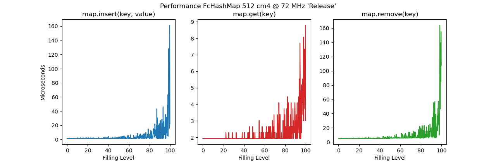

# FcHashMap

 A fixed capacity no_std hashmap.

 A Hashmap is a data structure that implements an associative array, a structure that can map
 keys to values. Inserting, deleting and searching of entries is fast. This size limited
 hashmap is intended for small systems and does not require a dynamic heap allocator and can
 be used on the stack. The basis of this implementation is the so-called Robin Hood hashing,
 which was originally developed by
 [Pedro Celis](https://cs.uwaterloo.ca/research/tr/1986/CS-86-14.pdf).
 In these two publications from Emmanuel Goossaert
 ([1](https://codecapsule.com/2013/11/11/robin-hood-hashing/),
 [2](https://codecapsule.com/2013/11/17/robin-hood-hashing-backward-shift-deletion/))
 the functionality is explained very nicely.

## Notes

 The realization of the hashmap is based on the Robin Hood hashing algorithm. This method  
 is simple and robust with reasonable performance. However, the fixed capacity implementation
 has some limitations:

 - The size of the hashmap must be fixed at compile time
 - 8 bytes ram are consumed per entry without keys and values
 - The maximum capacity is limited to 32768 entries
 - The capacity must be chosen as a power of 2
 - The hashmap should not be used to its full capacity, otherwise it will become slow.
   10 to 20 percent of the capacity should always be kept free.

 ## Example

 ```rust
 use fchashmap::FcHashMap;
 use hash32_derive::Hash32;
 use hash32::Hash;

 #[derive(Debug)]
 struct Reading {
     temperature: f32,
     humidy: f32,
 }

 #[derive(Copy, Clone, Debug, PartialEq, Eq, Hash32)]
 struct DeviceId([u8; 8]);

 impl DeviceId {
     fn new(input: &[u8; 8]) -> Self {
         let mut id = [0_u8; 8];
         id.copy_from_slice(input);
         Self(id)
     }
 }

 let mut fc_hash_map = FcHashMap::<DeviceId, Reading, 128>::new();

 let dev1 = DeviceId::new(b"12345678");
 let dev2 = DeviceId::new(b"12345679");
 let dev3 = DeviceId::new(b"12345680");

 fc_hash_map.insert(dev1, Reading { temperature: 23.1, humidy: 76.3 }).unwrap();
 fc_hash_map.insert(dev2, Reading { temperature: 22.7, humidy: 55.5 }).unwrap();

 let reading = fc_hash_map.get(&dev1).unwrap();
 assert_eq!(reading.temperature, 23.1);
 assert_eq!(reading.humidy, 76.3);

 let reading = fc_hash_map.get(&dev2).unwrap();
 assert_eq!(reading.temperature, 22.7);
 assert_eq!(reading.humidy, 55.5);

 assert!(fc_hash_map.get(&dev3).is_none());
 ```
 
 ## Performance

 The following diagram shows the timing behavior on a Cortex M4f system (STM32F3) at 72 MHz. It
 can be seen that the performance of the hashmap decreases significantly from a fill margin of 
 about 80%.
 

## Additional Remarks

In a project I use the crate ArrayVec because of missing functionality in Heapless::Vec. Since I 
needed additionally a HashMap I had to find out that there was no suitable stand alone HashMap, 
which gets along without memory allocation and is no_std compatible. Since I am learning Rust 
anyway, I decided to write my own hashmap.

For the realization of the hashmap I started from the above mentioned papers. For the 
implementation I got many ideas from the Japarics Heapless::FnvIndexMap. I found that this HashMap 
also uses Robin Hood hashing and I ended up with almost the same solution. Anyway, FcHashMap is 
unfortunately almost 200 bytes bigger but still about 10% faster than FnvIndexMap. Which 
realization is better to understand and maintain, please let everyone decide for himself. Many 
thanks to the authors of FnvHashMap for the many useful inspirations.

## License

Licensed under either of Apache License, Version 2.0 or MIT license at your option.
